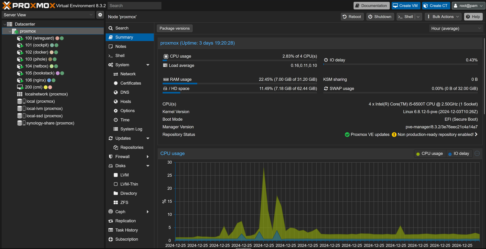

## What is a home lab?

For the unacquainted a home lab is a sacred thing for those who are in the field of computers. From those who are general information technology specialists to network engineers and even those who want to break free from the ever growing subscription services that seem to keep getting more expensive as we rely more on them. But in simple terms, a home lab is another term for a learning environment that people host at home. It can be a simple old computer that is running an instance of an Ubuntu server or even a virtual machine host to those who have a whole 42U server rack filled with goodies.

Its overall just en environment to learn new technology, learn new skills and much more. You may be wondering, well, why do people want a home lab or say they even need one? Well, its just due to the nature of technology, it is ever changing and those who are in the field need to keep their skills sharp. I learned that even though I may be getting my degree in Computer Information Systems this upcoming spring, it still does not guarantee me a job. I still also need to work on getting certifications such as A+, CCNA, and much more to have a better chance at being a competitive choice when I apply for a job. A home lab environment can help people put the knowledge they gained from studying into a practical area to hone their skills and better understand what they learn.

### Is it expensive?

No, not at all. You can start with an old PC or you can buy a Raspberry Pi or even a mini-pc. I don't recommend going all out with your first home lab. I am by no means a professional, more of a fledgling than anything, but I know the value of a dollar and home labs can take up a lot of those dollars. I envy those with massive home labs that are basically a mini data-center in their home. Another thing you must consider is power draw. That old PC that you used to game on can be a good choice for your wallet right now, but it could be drawing a few hundred watts at idle. I know my current gaming PC can pull a lot of watts at idle because I have the BIOS and the Windows 11 settings set to maximum performance.

Its just another thing to consider. My primary server for my home lab is a [HP EliteDesk 800 G3 Mini PC](https://www.ebay.com/itm/315248241753) for $60. I installed a 1TB NVMe and a 1TB SSD with 32 GB of RAM & It currently is running [Proxmox Virtual Environment 8.3](https://www.proxmox.com/en/proxmox-virtual-environment/overview). Proxmox is a super awesome Hypervisor that is constantly getting updates and is a great alternative to VMWare ever since he ISO file is now locked behind Broadcom's mess of a website.

## The stuff I am running

Now I don't have a whole lot running as I have hardware limitations I must abide by. Even with those I can run quite a bit of applications. The biggest thing that is used the most often is Nginx Proxy Manager so I can apply SSL certificates to all of my local applications and get rid of that pesky unsafe site warning. Additionally I am running a Wireguard server so when I am out and about I can safely and securely connect back to my home network and utilize my services. I initially thought of using Cloudflare's Zero Trust tunnels, but I don't really plan on having anything of mine being accessed by anyone else besides me... for now at least. I am also running a Docker instance with Portainer so I can work on containers via a website instead of using CLI. Then I also have some other things running here and there.

Overall, Proxmox is a great tool and there is a lot of community support. I am currently running all of theses in LXC's which are similar in nature to Docker containers. I don't want to get all into the technical aspect of LXC's vs docker containers as even I am still learning these things. Finally, the biggest thing I am running in proxmox is Cisco Modeling Labs. This is a powerful tool to help those who are working towards their CCNA or want to test out new network configurations before implementing them. I actually recently got this working after multiple failures. Proxmox recently implemented a way to import OVA files into the hypervisor which is what I initially tried to use, but couldn't get it working. Instead I used this [guide](https://mateuszfrak.com/posts/cml-on-proxmox/) by [Mateusz Frąk](https://mateuszfrak.com/) to get it up and running.

### Network Storage

The heart of my network by far is my Synology DS224+ NAS, Network Attached Storage. This is where I keep ISO files, documents, backups and much more. I can't stress how necessary a NAS of some kind is needed for a home lab. Not to mention how much it saved me whenever I broke my Windows 11 configuration and had to restore to the last backup. Its a wonderful ease of mind I have. This is also not exactly perfect. I want to use the golden rule of the 3-2-1 backup rule. Three copies, 2 types of media & 1 being off site. Right now I am running 2 8TB NAS drives in a mirrored config. If one of those drives failed I can be screwed as I wait for a new one to get here to replace the broken one.

## Issues I run into

Running a home lab is not all sunshine and rainbow. It is a lot of trial and error to get it stable and running. In a perfect world I would be running a production environment and a testing/development one. I would also be running my Proxmox with multiple nodes in a cluster to enable HA, High Availability, for applications that are used most often. But this isn't a perfect environment. Not to mention I am still working off of my parents home network still, so sectioning the network using VLANs is impossible right now. The reason I want to do that is to keep my home lab environment from affecting other users on the network and among other things.

And like I mentioned previously, my backup storage situation does not abide by the 3-2-1 rule and my NAS is only in a mirrored config. By far not the best it can be. The one saving grace overall is having all of this connected to a UPS, Uninterruptible power supply, just in case the power goes out and I can properly shut everything down. I don't want a power failure to wear down my hard drives any more than needed.

## Moving forward

There is a lot that I still want to do to make this home lab much better than it currently is. For now I may start with getting an identical mini pc like the one I got currently off ebay and cluster it. Proxmox also has a Ceph storage feature I want to try. I also want to get proxmox to run backups on everything every so often. There is a whole lot of other things I want to implement and make better, but I must keep climbing the mountain so that I can reach the apex.

## Resources

### Hardware & Software

Here is a list of the hardware and OS/Software providers that I mentioned throughout the blog:

- [Proxmox VE](https://www.proxmox.com/en/)
- [Proxmox Helper Scripts](https://community-scripts.github.io/ProxmoxVE/)
- [Synology](https://www.synology.com/en-us)
- [Cisco Modeling Labs 2.8 Free Tier](https://developer.cisco.com/docs/modeling-labs/cml-free/)
- [HP EliteDesk 800 G3 Mini PC](https://www.ebay.com/itm/315248241753)
    - [32GB RAM for Mini PC](https://www.amazon.com/gp/product/B079HJGQZ2/ref=ppx_yo_dt_b_search_asin_title?ie=UTF8&psc=1)
    - *You can run any NVMe SSD you wish and it supports a 2.5" SSD or HDD. I suggest watching a youtube video on how to upgrade the hardware if you have no experience doing so.*

### YouTubers & Other Resources

This is a list of the people on YouTube I have watched and learned a bunch of skills from. All of these people are highly experienced in the home lab space and are widely regarded as some of the best to watch. I also included the Home Lab reddit and the sales reddit as these are great sources for info from other people and second hand goods. I also recommend facebook marketplace to look for goods if you cant find anything on Ebay.

- [NetworkChuck](https://www.youtube.com/@NetworkChuck)
- [Jeff's CTO Laboratory](https://www.youtube.com/@jeffsponaugle6339)
- [Techno Tim](https://www.youtube.com/@TechnoTim)
- [Space Rex](https://www.youtube.com/@SpaceRexWill)
- [Hardware Haven](https://www.youtube.com/@HardwareHaven)
- [Home Lab Reddit](https://www.reddit.com/r/homelab/)
- [Home Lab Sales Reddit](https://www.reddit.com/r/homelabsales/)